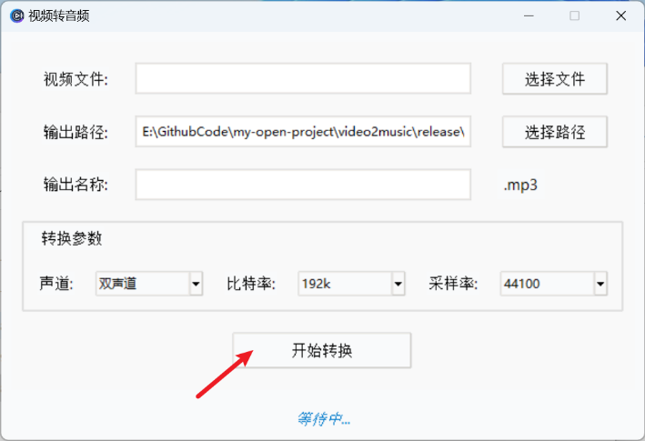

<p align="center">
    <br>

<br>
<br><b>video2music:视频转音频(mp3)</b><br>
<br>
</p>

使用 tkinter 编写的界面，通过ffmpeg将视频转为音频。

## 软件

软件打包exe下载：[release](https://github.com/MGzhou/video2music/releases/download/1.0/video2music-v1.0-win-x64.zip)

使用：

首先，将mp4视频**拖拽**到界面中，也可以通过 `选择文件`导入视频。

然后，点击 `开始转换`，稍等片刻就会弹出结果。

> 如果成功转换，默认导出文件夹是界面显示的 `输出路径`。



## 代码使用

### 环境准备

Windows

python 3.10

依赖安装

```
pip install requirements.txt
```

### 下载FFmpeg

windows 发行版本：[FFmpeg Builds - gyan.dev](https://www.gyan.dev/ffmpeg/builds/)

下载 `release builds` > `latest release`> [ffmpeg-release-essentials.7z](https://www.gyan.dev/ffmpeg/builds/ffmpeg-release-essentials.7z) 轻量版即可。

下载后解压，并复制 `ffmpeg-release-essentials/bin/ffmpeg.exe`文件到本项目文件夹下。

### 运行

```
python main.py
```

### 打包命令

通过xxx将代码打包为exe

```shell
# 该命令还不能使用
pyinstaller -F -w -n video2music main.py --icon=app.ico --paths [xxx]\Lib\site-packages --add-data "[xxx]\Lib\site-packages\tkinterdnd2;tkinterdnd2"  --hidden-import=tkinterdnd2 --clean
```

> 由于使用了第三方支持拖拽库tkinterdnd2，pyinstaller打包不能自动将该库文件打包，因此 `[xxx]`需要放置python路径，可以参考[博客](https://blog.csdn.net/Zao5544/article/details/142153205)。

## 感谢

[FFmpeg/FFmpeg](https://github.com/FFmpeg/FFmpeg)
